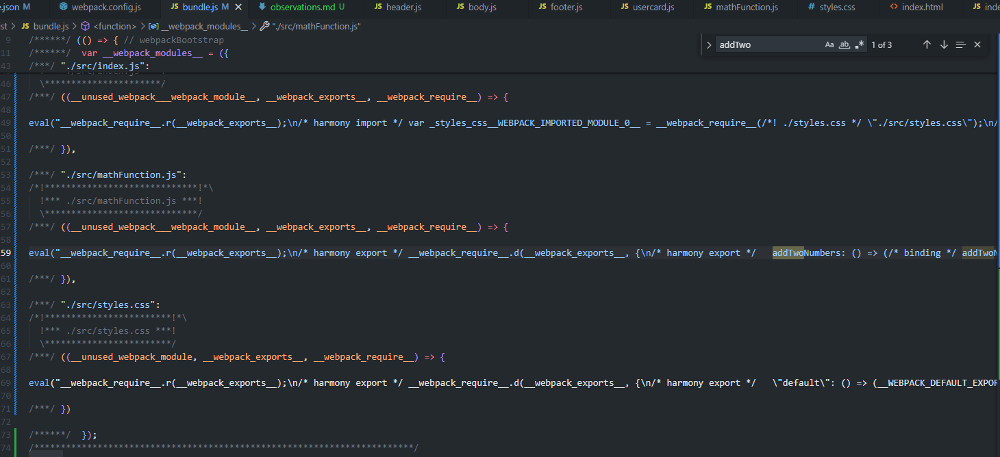
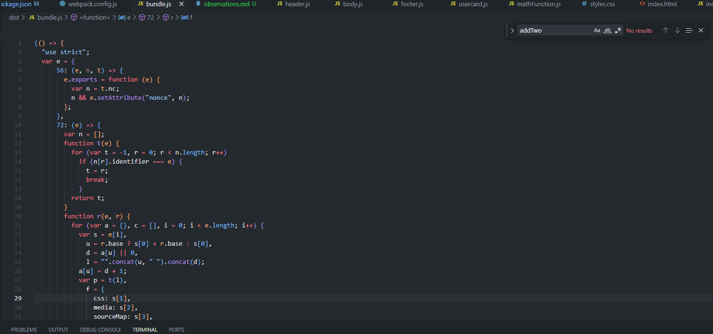

Tree Shaking: When tree shaking, I see that the addTwoNumbers function is removed from the bundle.js when I run production mode.

Loader behavior: I installed the css and style loaders using the npm install command. I imported the by using the async function init () in my index.js file. I was able to confirm it works because I could see the styles from my styles.css showing up when I run the build.
